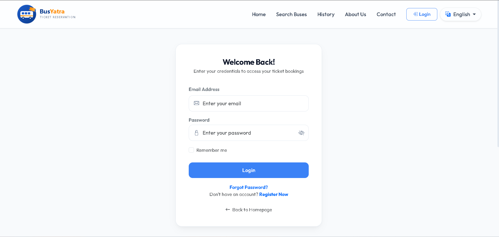
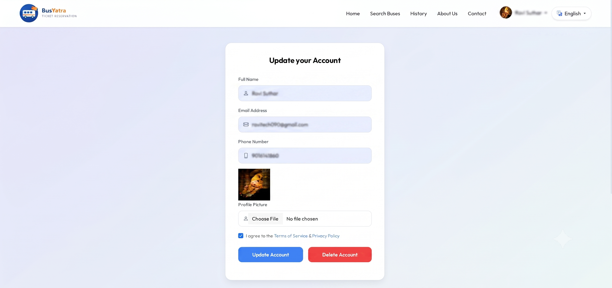
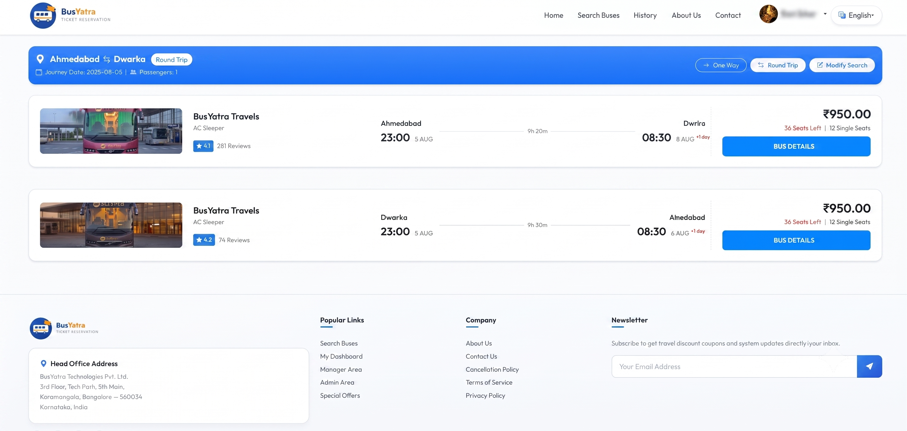
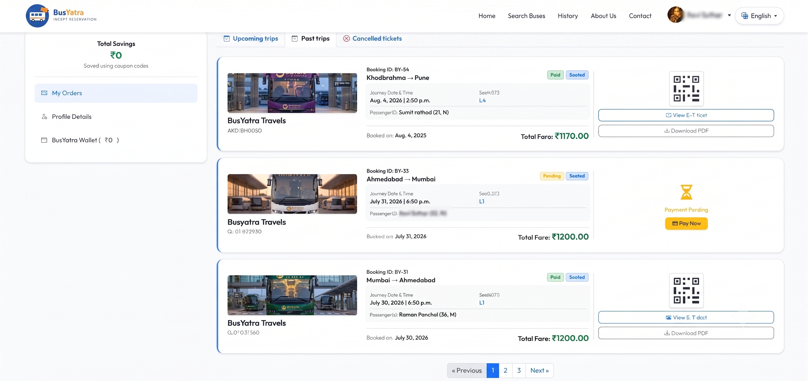
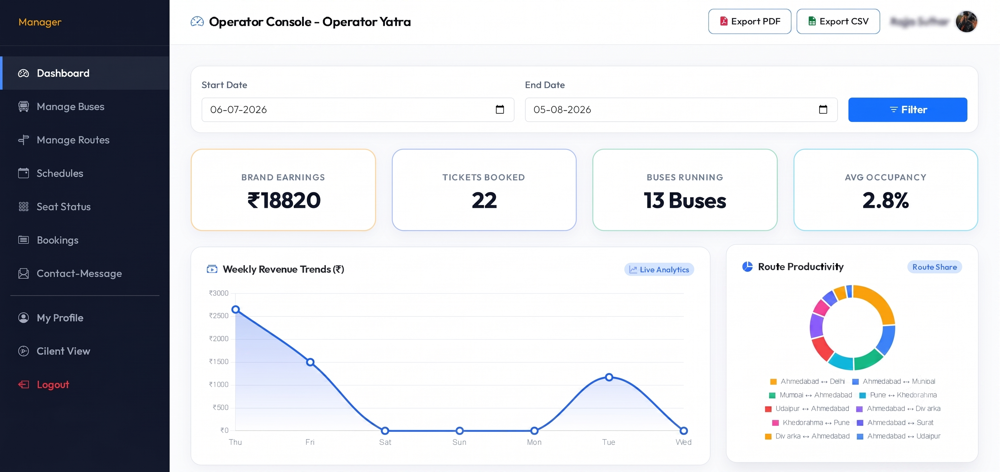

# 🚌 BusYatra

## Project Description

BusYatra is a modern, professional bus ticket reservation web application built with Django. It allows passengers to register, search bus routes, view real-time seat layouts, book seats, make secure online payments via Razorpay, receive automated PDF e-tickets with QR codes via email, and manage their trips.

The platform includes full role-based access control with separate management dashboards for **Customers**, **Bus Managers**, and **System Administrators** — providing complete control over buses, routes, schedules, bookings, payments, and analytical reporting.

---

## Features
- **User Registration & Login** — Session-based authentication, user profile management, and password recovery
- **Bus Search & Availability** — Search buses by source, destination, and travel date with dynamic real-time seat availability calculation
- **Interactive Seat Booking** — Seat layout visualization with automated seat locking (`SeatBooking`) to prevent double-booking
- **Razorpay Payments & Promo Codes** — Integrated sandbox payment checkout supporting discount coupon codes (`BUSYATRA100`)
- **Automated PDF E-Ticket & Email** — In-memory dynamic PDF ticket generation with QR code and automated Gmail SMTP email dispatch
- **Customer "My Orders" Dashboard** — Grouped booking cards, categorized into Upcoming Trips, Past Trips, and Cancelled Tickets, with 3-record per page pagination
- **Manager Dashboard** — Full CRUD management for buses, routes, and schedules, capacity analytics, and PDF/CSV report exports
- **Admin Management** — Comprehensive administrative control panel for customers, managers, buses, routes, schedules, and financial audits

---

## Installation & Setup

### Windows

```bash
# 1. Clone the repository
git clone https://github.com/brainybeamGit/BusYatra.git
cd BusYatra

# 2. Create and activate virtual environment
python -m venv myenv
myenv\Scripts\activate

# 3. Install dependencies
pip install -r myenv/BusYatra/Bus/requirements.txt

# 4. Set up environment variables
copy myenv\BusYatra\.env.example myenv\BusYatra\.env

# 5. Run database migrations
python myenv/BusYatra/manage.py makemigrations
python myenv/BusYatra/manage.py migrate

# 6. Seed initial database data (Manager & Sample Buses)
python myenv/BusYatra/seed_buses.py

# 7. Create a superuser (admin account)
python myenv/BusYatra/manage.py createsuperuser

# 8. seed_buses file run command
 

# 8. Start the development server
python myenv/BusYatra/manage.py runserver
```

Open **http://127.0.0.1:8000** in your browser.

---

### macOS / Linux

```bash
# 1. Clone the repository
git clone https://github.com/brainybeamGit/BusYatra.git
cd BusYatra

# 2. Create and activate virtual environment
python3 -m venv myenv
source myenv/bin/activate

# 3. Install dependencies
pip install -r myenv/BusYatra/Bus/requirements.txt

# 4. Set up environment variables
cp myenv/BusYatra/.env.example myenv/BusYatra/.env

# 5. Run database migrations
python3 myenv/BusYatra/manage.py makemigrations
python3 myenv/BusYatra/manage.py migrate

# 6. Seed initial database data (Manager & Sample Buses)

# 7. Create a superuser (admin account)
python3 myenv/BusYatra/manage.py createsuperuser

# 8. Start the development server
python3 myenv/BusYatra/manage.py runserver
```

Open **http://127.0.0.1:8000** in your browser.

---

## Credentials

- **Admin / Superuser Account:**
   - Username :- admin1
   - Email :- admin1@gmail.com
   - Password :- admin1

- **Manager Account (Pre-seeded):**
  - Username :- manager1
  - Email: manager1@gmail.com
  - Password:- manager1
---

## 🛠️ Technology Stack

| Component | Technology / Library | Description |
| :--- | :--- | :--- |
| **Core Framework** | Python 3.10+ / Django 5.x / 6.x | Robust MVT Web Architecture |
| **Database** | SQLite3 | Local relational SQL database |
| **Payment Gateway** | Razorpay SDK | Sandbox environment payment processing |
| **PDF Generation** | ReportLab 5.0.0 | Dynamic in-memory PDF receipts with QR code |
| **Email Service** | Gmail SMTP | Automated e-ticket receipt dispatch |
| **Images & Assets** | Pillow 12.3.0 | Image upload processing for profile and bus assets |
| **Frontend Styling**| Bootstrap 5, Custom CSS & SVG Favicons | Responsive UI optimized for mobile and desktop |

---

## 🧪 Running Automated Unit Tests

Automated tests are set up inside `Bus/tests.py`. Validate view responses, ticket generation logic, pagination, and seat isolation by running:

```bash
python myenv/BusYatra/manage.py test Bus
```

---

## Screenshots

### 1. Home-page


### 2. Login-page


### 3. Profile-page


### 4. Buslist-page


### 5. History-page


### 6. Manager-page

